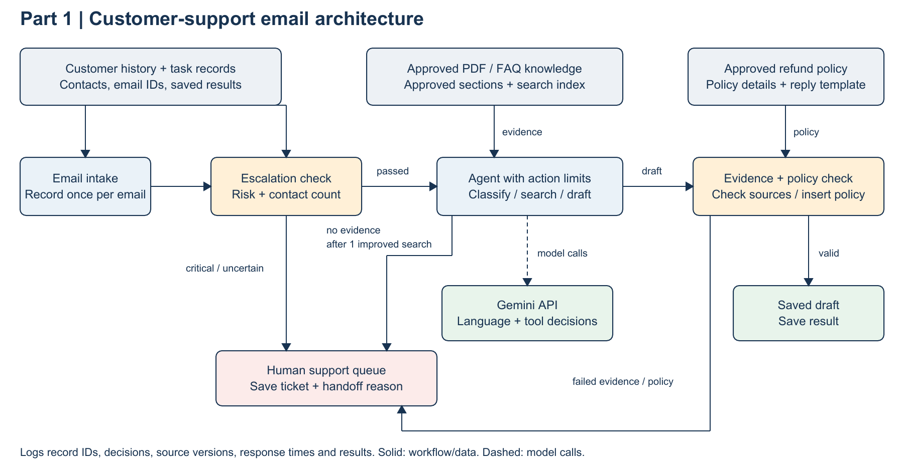
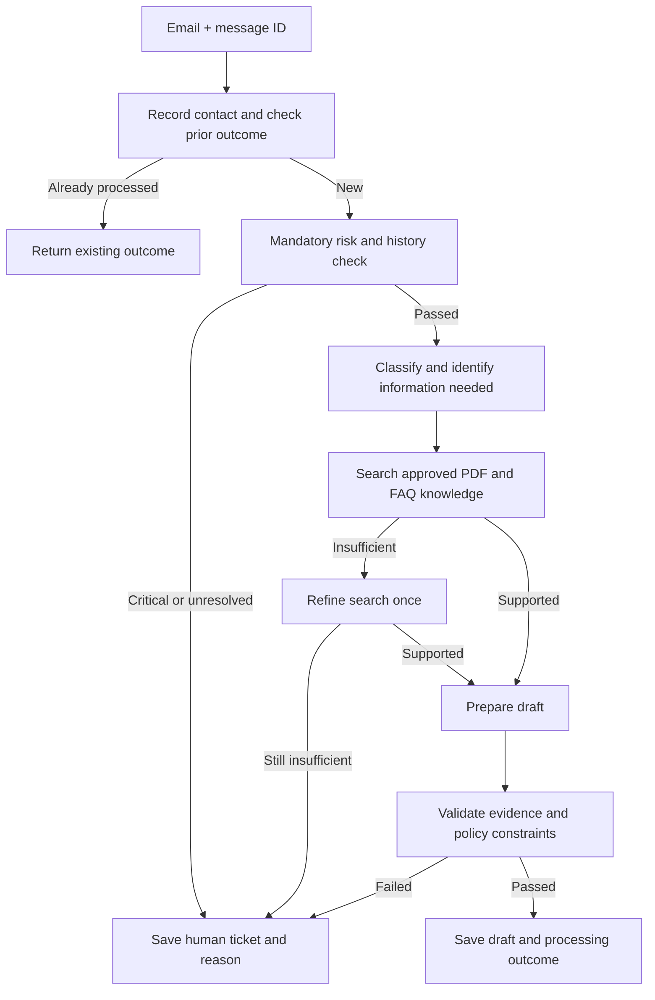

# Customer-support email system design

## Scope and assumptions

Part 1 proposes a system for handling customer-support emails. It assigns categories, prepares replies from approved PDFs and FAQs, and sends high-risk cases to human support staff. The system saves either a reply draft or a support ticket. Sending emails and approving refunds are outside this design. The working document agent is described in Part 3.

The assessment did not provide a knowledge base, refund policy, expected email volume, or customer-history format. The OrbitDesk handbook in Part 3 is fictional sample data.

The following assumptions would need confirmation from the business:

- One contact is one received support email with a unique message ID. Processing the same email again does not create another contact.
- The current email counts towards the total. The fourth contact within seven days triggers a human handoff.
- The seven-day period includes both end points, from `received_at - 7 days` to `received_at`, using UTC. An email received later is not counted when processing an earlier email.
- Each contact belongs to a verified customer ID. If the customer cannot be identified or their history is unavailable, the email goes to a human.
- An email can have more than one category, such as Billing and Technical. Feedback is another supported category.
- A policy owner must approve extracted policy information before the assistant can use it.

## System architecture diagram

The diagram shows the main processing steps, approved information sources, the Gemini connection, and the two outcomes: a saved draft or a human support ticket. The flow below also shows the retry and search-improvement paths.

Before writing a reply, the system checks for data loss, a service outage, or a security breach. It also checks whether the customer has contacted support more than three times in seven days. Any of these conditions sends the email to a human. Missing customer details, incomplete history, or uncertain risk also blocks drafting.

### Processing flow

Critical emails are flagged immediately. A separate task can assign categories to help staff organise the ticket, but it cannot write a reply or delay the handoff.

## Component responsibilities

| Component | Responsibility |
| --- | --- |
| Email intake and processing store | Record each contact before counting it, with one record for each message ID. Claim the task in one database action so two workers cannot process the same email. Save the final result. If processing is retried, return the saved result or continue unfinished work. |
| Escalation check | Block drafting until the risk check passes. Count the customer's separate contacts in the seven-day period. Always flag the three required critical terms. Use a language classifier for similar wording. Send uncertain results or failed checks to a human. |
| Email classifier | Assign one or more categories: Billing, Technical, and Feedback. Mark unclear cases as unresolved. The model cannot override the escalation check. |
| Knowledge search | Search approved PDF and FAQ sections, keeping the document ID, version, and page or section reference. The search index is built from these sources and can be rebuilt. |
| Agent with limited actions | Choose searches that match the customer's question and review the results. Allow one improved search if the first result is insufficient. If evidence is still missing, send the case to a human. The agent cannot send emails, issue refunds, or skip the escalation check. |
| Reply writer and checker | Write the draft from retrieved information. Require source references, check that quoted text exists, and apply the policy rules. Do not produce a reply without support. |
| Human support queue | Save the handoff reason, any available categories, and useful source references. Staff can access the original email through the protected ticket system. |

## Preventing incorrect refund-policy statements

Finding relevant information and telling an LLM to follow it does not guarantee a correct reply. Refund-policy replies therefore use approved templates:

1. Extract the policy from an approved PDF or FAQ and store its source and version. The policy owner checks the stored fields and customer-facing template. Extracted text is not approved automatically.
2. Select the relevant policy version. If the policy is missing or contradictory, send the case to a human.
3. Fill the approved template with verified deadlines, eligibility rules, and exclusions. Code inserts this text directly, so the model cannot rewrite the policy terms.
4. Use this process for every statement about refunds or eligibility. Send mixed or unclear requests to a human when the template cannot answer them safely. Do not say that a refund is approved without verified customer information and human authorisation.

The LLM can identify what the customer wants or choose a search query, but it cannot change approved policy terms. Part 3 demonstrates document-based answers; it does not implement this refund-template process.

## Data records

- `Contact`: unique message ID, verified customer ID and received time. Index the customer ID and timestamp to support seven-day history searches.
- `Processing`: message ID, current state (`pending`, `checking`, `human`, `draft`), risk decision, reason, categories, source IDs, policy version and output ID. Only one worker owns the task at a time, and the final result is kept when processing is retried.
- `KnowledgeSection`: document ID, version, section or page ID, text and approval status.
- `RefundPolicy`: policy ID and version, approved fields, approved template and source references.

Customer-history and processing records are the source of truth. The search index is a separate copy used to find information. A production version should use database transactions to prevent duplicate contacts and update processing states safely. When several emails from one customer arrive together, all contacts must be counted so the fourth contact cannot avoid escalation.

## Handling failures

| Problem | Response |
| --- | --- |
| Customer identity is unclear or history cannot be loaded | Send the case to a human. Do not assume there were no previous contacts. |
| A critical phrase is found, similar wording is classified as critical, or risk is uncertain | Flag the email before drafting and save a human support ticket. Test missed detections and negative statements separately. |
| Knowledge is missing or conflicting after one improved search | Send the case to a human with an explanation. Do not guess a reply. |
| The model times out, reaches a quota limit, returns invalid categories, or provides unsupported evidence | Retry only within a set limit, then send the case to a human. |
| Refund policy is unapproved or conflicting | Block the refund reply and ask a human to handle it. |
| The same email arrives again or a worker retries it | Use the message ID and saved processing state to avoid counting the contact or saving the outcome twice. |
| The processing store is unavailable | Keep the task pending, retry within a set limit and alert the operations team. Do not draft or claim that a ticket has been saved. |
| The queue grows or the model limits request rates | Limit the number of workers running together, increase the delay between retries, and monitor the oldest waiting email. Prioritise critical handoffs. |

The assessment does not give an expected workload. Capacity would need to be measured using model response times, request quotas, and queue waiting times. With an average model latency of `L` seconds and `C` workers, `C/L` is a rough upper limit on model requests per second before other work and provider limits are considered. Retries also use this capacity. This is an estimate, not a measured benchmark.

## Planned tests and monitoring

Part 1 is a design. These checks are planned for a future implementation and have not been run against an email service:

- Each required critical condition prevents the reply-writing function from running.
- Three contacts pass the contact-count rule; four trigger a handoff. Test exact time boundaries and repeated message IDs.
- Missing history or unclear customer identity prevents drafting.
- A mixed email can receive multiple category labels.
- Refund replies cannot include terms that are absent from the approved policy.
- Missing evidence, model timeouts and repeated worker tasks produce the expected outcomes.

Logs should record the message ID, processing step, categories, escalation reason, source IDs, policy version, response time, and outcome. Routine logs should not include email bodies, credentials, or personal details. Monitor missed critical issues, unsupported answers, queue waiting times, model errors, and usage costs. A matching citation shows where information came from, but does not prove that the answer interpreted it correctly. Human review and failure-focused tests are still needed.

## Trade-offs

A controlled workflow makes the required checks easy to follow and enforce. The agent can choose and improve searches, while the application controls whether drafting is allowed. Direct SDK calls keep the prototype small. LangGraph could be useful if the system later needs more workflow states or recovery after restarts. Several independent agents would add coordination work without a clear benefit for this assessment.

Sending uncertain cases to humans reduces the number of automated replies, but lowers the risk of unsafe drafts. Exact phrase checks are predictable, although they can miss similar wording. A language classifier can identify more cases, but it needs testing and may still miss some issues. Approved refund templates limit writing flexibility and need maintenance, but they keep policy terms under business control.
