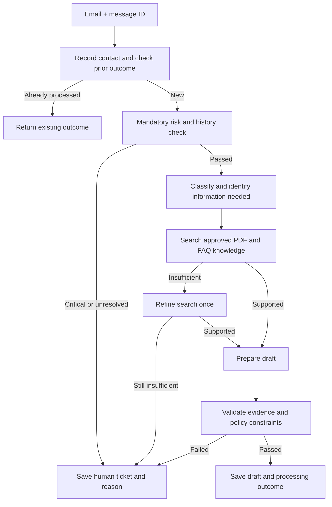

# Customer-support email system design

## Scope and assumptions

This is the Part 1 design deliverable; the runnable document agent is Part 3. The system classifies emails, drafts responses from an approved PDF/FAQ knowledge base, and records human handoffs. Its output is a saved draft or a human ticket. Sending emails and issuing refunds are outside the requested scope.

No employer knowledge base, refund policy, traffic figures, or customer-history schema was supplied. OrbitDesk's Part 3 handbook is fictional demonstration data.

Assumptions to confirm with the business:

- A contact is one distinct received support email identified by a stable message ID. Retries are not new contacts.
- The current email counts. More than 3 means the fourth contact triggers escalation.
- The window includes timestamps from `received_at - 7 days` through `received_at`, inclusive, using UTC. Later contacts are not included in an older email's count.
- Contacts are associated with a verified customer ID; unresolved identity or unavailable history requires human handling.
- Categories may overlap: an email can be both Billing and Technical. Feedback is another supported label.
- A policy owner approves extracted policy content before it becomes usable by the assistant.

## System architecture diagram

The diagram shows application stages, authoritative/derived knowledge sources, the model dependency, and human/draft outcomes. The detailed control flow below includes the retry and refinement branches.

The escalation gate flags mentions of data loss, service outage or a security breach, and more than three distinct contacts from the same verified customer in the seven-day window. The current email counts. Unknown identity, incomplete history or unresolved risk requires human handoff before drafting.

### Processing flow

Critical emails are flagged immediately. Their category can be recorded by a classification-only task for the human queue; that task has no drafting capability and cannot delay the critical flag or handoff.

## Responsibilities and authority

| Component | Responsibility and enforcement |
| --- | --- |
| Intake and state store | Store the distinct contact before counting; one record per message ID. Atomically claim processing and persist the terminal outcome. A retry returns an existing outcome or resumes pending work. |
| Escalation gate | Block drafting until a risk decision is recorded as passed. Query distinct contacts for the verified customer and window. Literal mentions of data loss, service outage, or security breach always flag. Detect additional phrase variants with a language classifier; uncertain/failed detection goes to humans. |
| Classifier | Return validated labels from Billing, Technical, Feedback, plus an unresolved result when necessary. Allow multiple labels. Do not let model output override the escalation gate. |
| Knowledge search | Read approved PDF/FAQ sections with document ID, section/page, and version. Search indexes are derived from these sources and can be rebuilt. |
| Bounded agent | Choose relevant knowledge searches based on the customer's question and inspect returned evidence. Permit one query refinement; missing evidence then ends in human handoff. No access to sending, refund issuance, or bypassing the gate. |
| Draft and validator | Draft only from retrieved evidence. Require source references; verify the cited excerpts exist and check policy constraints. Withhold unsupported answers. |
| Human queue | Persist escalation reasons, categories when available, and useful source references. Give humans the original email in the protected ticket system. |

## Refund-policy safeguard

RAG and an instruction alone cannot ensure that every generated policy claim is correct. Use a narrower output path for refund-policy questions:

1. Ingest the approved policy PDF/FAQ, retaining its source and version. A policy owner approves the structured record and customer-facing template; automatic extraction alone is not authoritative.
2. Resolve the applicable policy version. If a policy is missing or contradictory, record a human handoff.
3. Populate approved template text from approved fields for deadlines, eligibility and exclusions. Insert that text programmatically; keep it out of free-form model rewriting.
4. For any email involving refunds, keep all policy/eligibility wording within this controlled path. Mixed or ambiguous requests that cannot be expressed safely go to humans. Never claim approval without verified customer facts and human authority.

An LLM may classify intent or formulate a knowledge query, but it cannot alter approved policy terms. The Part 3 agent demonstrates general document grounding and does not implement this production template workflow.

## Small data model

- `Contact`: unique message ID, verified customer ID, received timestamp. Index customer ID and timestamp for window queries.
- `Processing`: message ID, state (`pending`, `checking`, `human`, `draft`), risk decision, reason, categories, source IDs, policy version, output ID. One owner at a time; terminal outcome survives retries.
- `KnowledgeSection`: document ID, version, section/page ID, text, approval status.
- `RefundPolicy`: policy ID/version, approved fields, approved template, source references.

The customer-history and processing records are authoritative. Retrieval indexes are derived. The chosen prototype needs no distributed consistency machinery; a production implementation should use transactions for contact deduplication and state transitions. Concurrency for different emails from the same customer must not lose contacts or bypass the threshold.

## Failure behavior

| Failure | Outcome |
| --- | --- |
| Unknown identity or history lookup failure | Human handoff; never assume zero contacts. |
| Explicit critical phrase, paraphrase classified critical, or uncertain risk | Flag before drafting, then save human ticket. Test false negatives and negation cases separately. |
| Knowledge missing/conflicting after one refinement | Human handoff with reason; no guessed response. |
| Model timeout, quota error, invalid labels or invalid evidence | Bound retry attempts; save human ticket when exhausted. |
| Unapproved/conflicting refund policy | Block the refund response and request human handling. |
| Duplicate input or worker retry | Unique message ID and persisted state prevent duplicate contact counts or terminal outputs. |
| State store unavailable | Leave work pending for bounded retry and alert operations; do not proceed to drafting or claim a human ticket was saved. |
| Queue backlog or model rate limit | Limit worker concurrency; back off retries and monitor oldest pending email. Prioritise critical handoffs. |

There are no supplied load numbers. Establish sustainable throughput by measuring model latency, request quotas and queue age under a stated workload. For average model latency `L` seconds and `C` workers, a rough upper bound is `C/L` model requests per second before provider quotas and other work; retries consume the same capacity. Do not present this estimate as a measured benchmark.

## Verification and observability

Planned Part 1 acceptance cases (design targets, not executed email-system tests):

- Each literal critical condition prevents the drafting function from being invoked.
- Three contacts pass the count rule; four escalate. Boundary timestamps and repeated message IDs are checked.
- History unavailable and ambiguous customer identity block drafting.
- Multiple category labels can be returned for a mixed email.
- Unsupported refund terms cannot appear in the controlled policy output.
- Missing evidence, model timeout, and duplicate worker delivery reach the defined outcomes.

Log message ID, stage, category, escalation reason, source IDs, policy version, latency and outcome. Avoid email bodies, credentials and personal details in routine logs. Monitor escalation detection accuracy, grounded-answer errors, queue age, model error rate and token/request costs. A passing citation check establishes provenance, not semantic entailment; human sampling and adversarial evaluations remain necessary.

## Trade-offs

A controlled workflow makes mandatory gates explicit. Bounded search decisions provide useful agentic behavior without giving the model authority over escalation. Direct SDK calls keep the prototype small; LangGraph would become useful if durable workflow execution or more states justified its dependency. A full autonomous or multi-agent design adds coordination and failure paths without a requirement that needs them.

The conservative human fallback trades automation coverage for fewer unsafe drafts. Literal checks are predictable but miss paraphrases; language detection broadens coverage but needs evaluation and cannot guarantee perfect recall. Controlled refund templates reduce writing flexibility and require policy maintenance in exchange for keeping policy terms authoritative.
